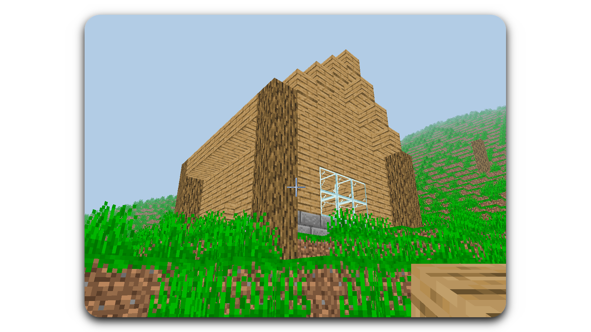

# CloneCraft

CloneCraft is a work-in-progress open-source recreation of the game Minecraft.

## Table of Contents

1. [About CloneCraft](#about-clonecraft)
	1. [Features](#features)
	1. [Developers](#developers)
1. [Getting Started](#getting-started)
	1. [Dependencies](#dependencies)
	1. [Getting the Source](#getting-the-source)
1. [Contributing](#contributing)
1. [License](#license)

# About CloneCraft

CloneCraft is still in heavy development.

## Features

* Breaking and placing different types of blocks.
* Basic multiplayer.
* Native modding support.
* It's made in Java, which is pretty awesome.

## Developers

   ### Lead Developer
   * [Antho](https://github.com/RealAnthowo)
   ### Contributors
   * [Aaron](https://github.com/gear4s)
   * [Alast-ai](https://github.com/alast-ai)

**[Back to top](#table-of-contents)**

# Getting Started

## Dependencies

* [Lombok](https://projectlombok.org/download). This is a simple utility library that we use.
* [LWJGL3](https://www.lwjgl.org/customize). This gives us access to opengl and other things that we will use. Select the None preset and for contents select, GLFW, and OpenGL, under addons select, JOML, select the natives for you platform and download the zip.
* [Kryonet](https://github.com/EsotericSoftware/kryonet/releases/download/kryonet-2.21/kryonet-2.21.zip). This gives up an easier time with networking.

## Getting the Source

CloneCraft is [hosted on github](https://github.com/RealAnthowo/CloneCraft). You can clone CloneCraft directly by using this command:

```
git clone git@github.com:RealAnthowo/CloneCraft.git
```

**[Back to top](#table-of-contents)**

# Contributing

We really like public contributions! Before contributing, please review [CONTRIBUTING.md](CONTRIBUTING.md).

**[Back to top](#table-of-contents)**

# License

CloneCraft is licensed under the GLU General Public license. See the [LICENSE](LICENSE) file for more details.

**[Back to top](#table-of-contents)**
